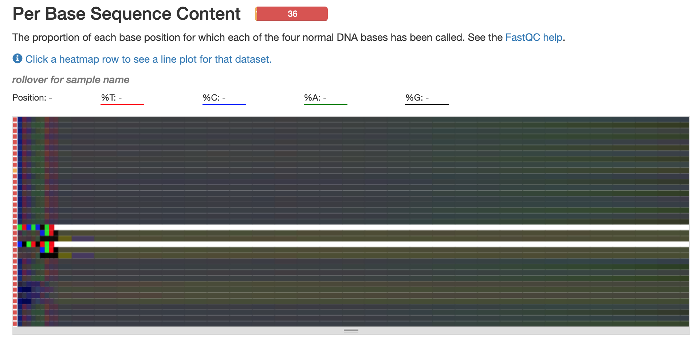
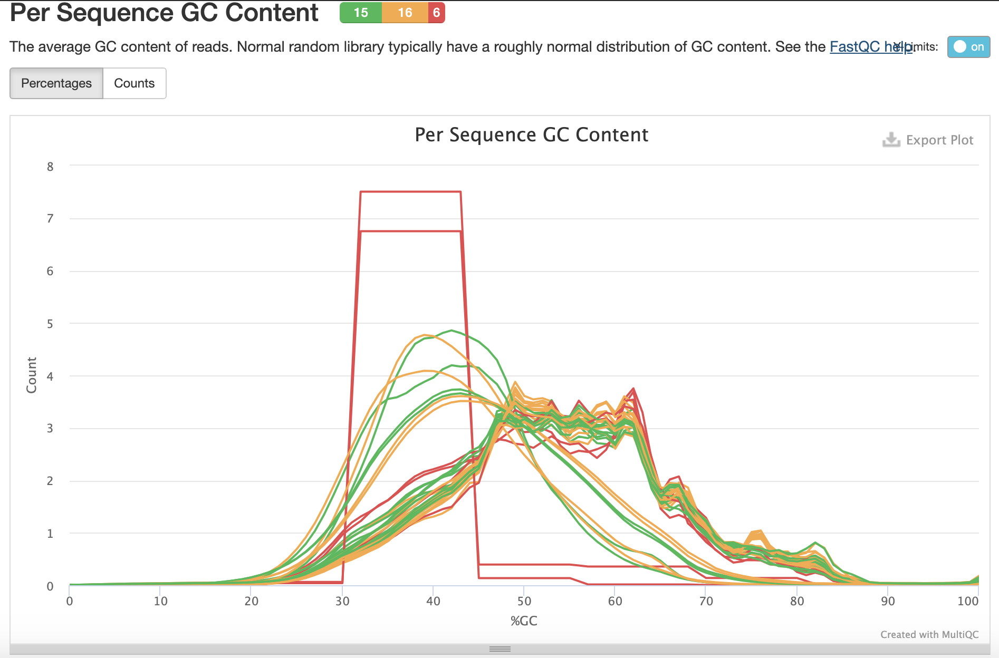

```{r setup, include=FALSE}
knitr::opts_chunk$set(echo = TRUE)
start_time <- Sys.time()
```

```{r, eval=F, echo=F}
library(here)
library(tidyverse)
dir.create("results/", recursive = TRUE, showWarnings = FALSE) #no longer using this structure since I'm trying to use snakemake
dir.create("fasta_files/", recursive = TRUE, showWarnings = FALSE)
dir.create("scripts/", recursive = TRUE, showWarnings = FALSE)

```

## Overview
Based on reviewer feedback, our goal is to integrate RNAseq results from Elliott's PBMC and fibroblast FeLV trial with the transcriptome projects pulled down from NCBI.

<br>

## Pipeline (as I understand it)

1. __Sample QC:__ fastqc + multiqc of raw RNAseq reads
1. __Trimming & Mapping 1:__ Generate indexes of enFeLV from the [fasta file](enFeLV.fasta) that Elliott provided.
1. __Trimming & Mapping 2:__ Run Elliott's cutadapt + bowtie2 script, which I have [amended](scripts/SA3_base_operations_cait.sh) to work with our new reads.
1. __Quantification:__ generate read counts mapped to each index using TMM normalization.

<br>

## Sample QC

I've generated QC files of each library using this [batch script.](scripts/fastqc.sh)

All the libraries look [okay](results/multiqc/raw/multiqc_report.html), except for:

1. `DC2Pool_NoIndex_L001_I1_001.fastq.gz` and `DC3Pool_NoIndex_L001_I1_001.fastq.gz`, which are only 8bp long instead of 150bp:

<br>



<br>

2. `DC1PLUS_S8_L002_R2_001.fastq.gz` seems to have failed sequencing because the file is only 8.8MB. I went back and checked Elliott's files on CVMRIT03, and it's the same size there. __It won't unzip because there's an 'unexpected end of file,' which makes me think it didn't download properly.__ 

3. The GC content for most samples is slightly higher and less normally distributed than expected. The jagged peaks could represent contamination (e.g. adapter content), which will hopefully resolve after trimming. The two red square lines are the failed DC2Pool and DC3Pool libraries:

<br>



<br>

4. All the libraries have universal illumina adapter contamination, which will resolve with cutadapt.

<br>

## Trimming and mapping 1

I'll use the fasta file that Elliott provided to generate four separate indexes. First, I created a conda environment with the versions of cutadapt and bowtie2 that Elliott used:

```{bash, eval=F}
conda create -n enFeLV -c bioconda cutadapt=1.18 bowtie2=2.3.4.1
conda activate enFeLV
```

Then, generate indexes:
```{bash, eval=F}
for fa in fasta_files/*.fasta; do
    bowtie2-build $fa ${fa%%.*};
done

mv fasta_files/*.bt2 data/
```

All fastq files __except__ the two that failed are in the `data`/ directory. (Note: had to remove _ in Mischief_minus and Mischief_plus for code to work.)

<br>

## Trimming and mapping 2: Elliott's script

Following Elliott's script, which I [modified](scripts/SA3_base_operations_cait.sh) for our RNAseq files, I trimmed the raw reads with cutadapt, then mapped them to the indexes generated above.

I made some errors in file renaming, which were easily fixed with a sed loop such as:

```{bash, eval=F}
for f in *fc.fastq.gz; do mv "$f" "$(echo "$f" | sed s/L002R/L002_R/)"; done
```

Original job (id 7189207): 70G mem, 22 cpus-per-task, 10H (finished in 00:08:40)
Second job (id 7190427) to map incorrectly named files: 70G, 22 cpus-per-task, 3H (finished in 00:01:04)

<br>

### Questions

1. Why did you run cutadapt -q in single end mode?
1. I'm getting an error that the adapter sequences provided are incomplete. Specifically, adapter 2 (GATCGGAAGAGCACA) provided is preceded by A 95% of the time and generates an error:

<br>

          WARNING:
          The adapter is preceded by "A" extremely often.
          The provided adapter sequence could be incomplete at its 3' end.

To see where the errors are occurring, use grep to search and print the subsequent 3 lines:

```{bash, eval=F}
grep -A 3 -B 1 "One or more of your adapter sequences may be incomplete" output-7189207 > cutadapt_warnings.txt
```

From this file, we can see that the error occurs for every R2 library, e.g.:

          WARNING:
              One or more of your adapter sequences may be incomplete.
              Please see the detailed output above.
          This is cutadapt 1.18 with Python 3.6.13
          Command line parameters: --cores=20 -a AGATCGGAAGAGCGT /
          -a GATCGGAAGAGCACA -o 4438_S1_L002R2_002_fc.fastq.gz /
          4438_S1_L002R2_001_f.fastq.gz

<br>

## Check trimmed files

At this point, I'll re-run my QC script on the libraries trimmed with cutadapt, just to make sure that adapter content and GC content has improved.

